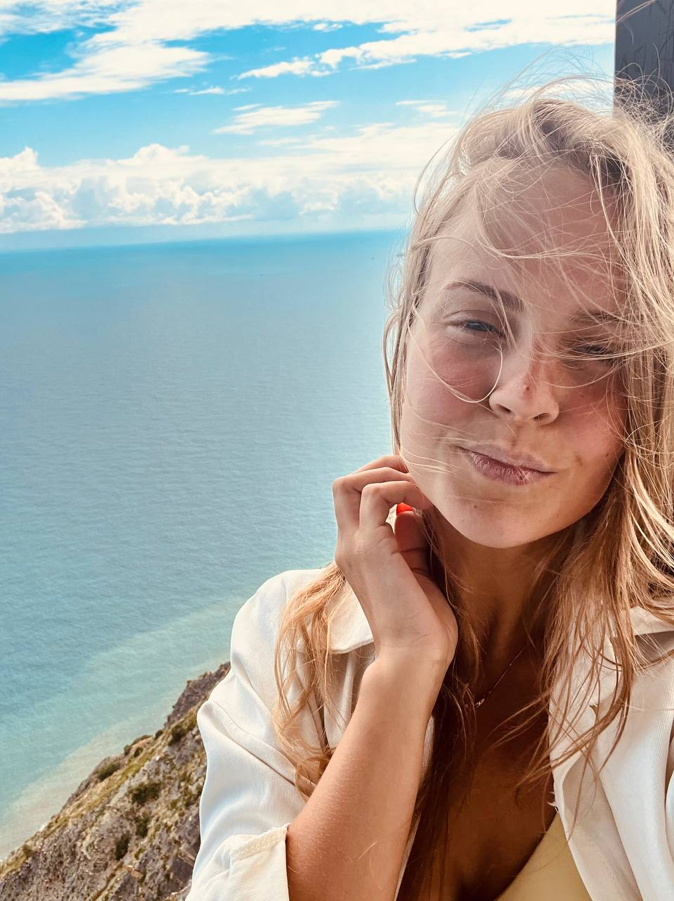

# Немного обо мне

Меня зовут Романова Александра.
Я работаю в компании ООО ИРБ.
Проживаю в замечательном городе Санкт-Петербурге. 

**Опыт и навыки**

_Профессиональный опыт_:

Опыт работы в IT более 9 лет. Мой путь начинался с технической поддержки, сейчас я являюсь менеджером проектов и развиваю сервис деск платформу Simple One. Поэтому и решилась на обучение Frotnend. 
Имеется опыт управления командой - 3 человека. 

_Ключевые навыки_:

Опыт управления проектами.

Многозадачность.

Эмоциональный интелект.

Руководство сотрудниками.

**Образование**

_Среднее-специальное_:
Техник информационных систем. 2012-2015

_Доп.образование_: Frontend разработчик. Обучаюсь по сей день. 

**Интересы и увлечения**

_Хобби_:
Люблю ходить в спортзал и прогуляться на велосепеде в хорошую погоду. Люблю смотреть фильмы в хорошей компании. У меня много домашних животных с которыми я также провожу много свободного времени дома и на природе. 

_Ценности_:

Ответственность за результат

Саморазвитие и обучение

Взаимопонимание в команде

Креативность в решении задач

Целеустремленность в достижении результатов

Дисциплинированность в работе

Контакты:

Email: sashkaromashka200@gmail.com

Телефон: +79697021379
Социальные сети: ВК. 
